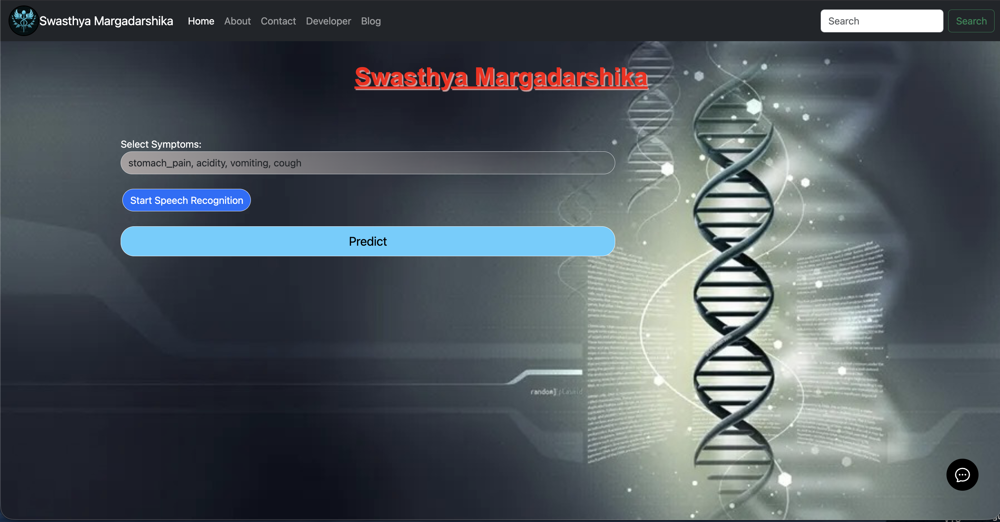
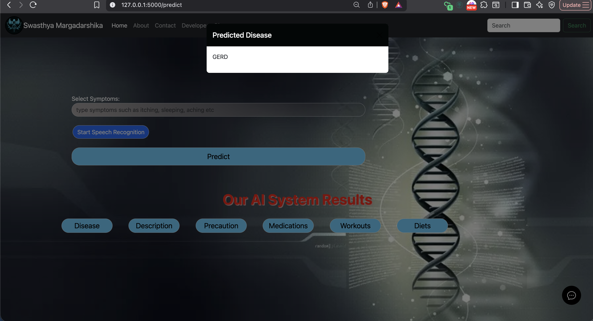
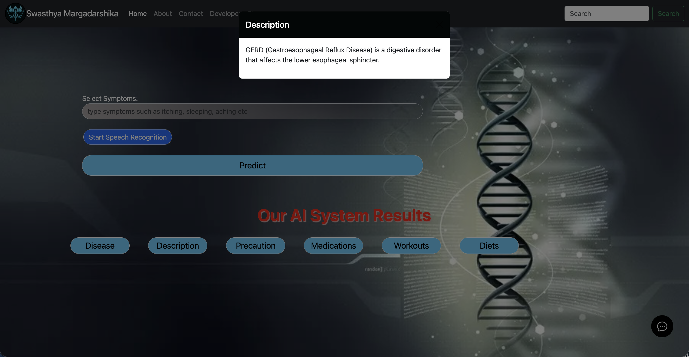
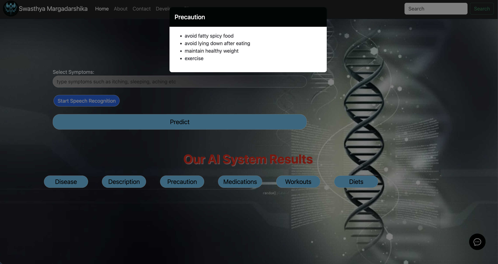
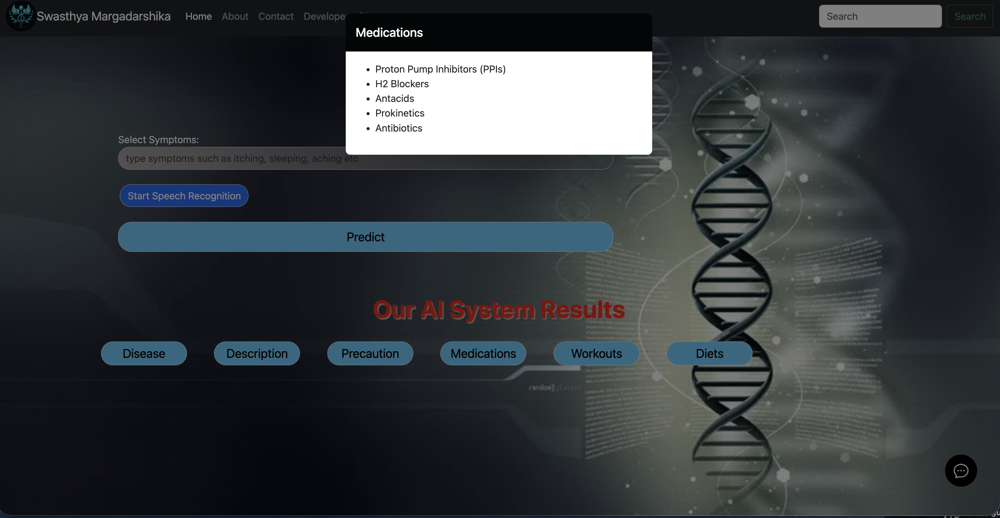
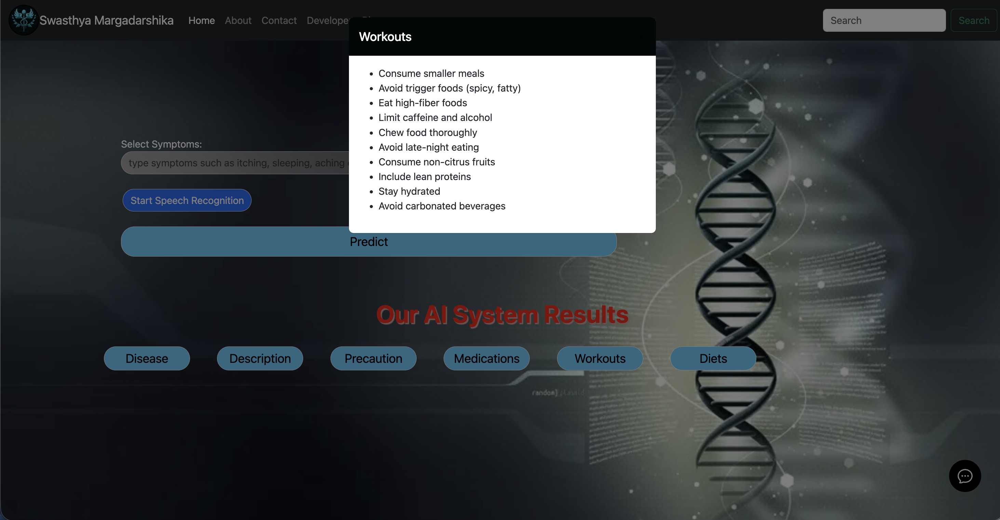
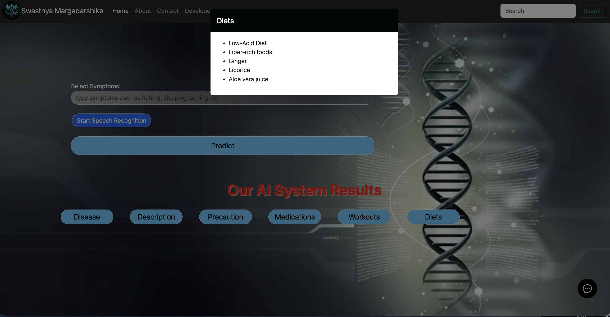

# Swasthya Margadarshika – Full-Stack Healthcare Web Application

**Swasthya Margadarshika** is a deeply interactive, AI-powered full-stack healthcare web application designed to act as a personalized medical recommendation system. 

Demoed in **July 2024, Bengaluru**, this platform is tailored to empower users by assisting them in understanding and managing their health effortlessly and accurately.

## 🚀 Key Features

- **Multilingual AI-driven Health Assistant:** Enables users to input their symptoms seamlessly via text or voice in their chosen language.
- **Advanced Disease Prediction:** Utilizes state-of-the-art machine learning models (Support Vector Classifier) to analyze inputted symptoms and accurately predict potential diseases.
- **Comprehensive Recommendations:** Once a disease is predicted, the system provides extensively tailored recommendations covering:
  - **Medications** (Top 5 suggested)
  - **Home Remedies & Diets**
  - **Precautionary Measures**
  - **Workout Routines**
- **Enhanced Accessibility:** Includes integrated voice-based output and speech recognition to drastically improve accessibility, specifically aiding visually impaired and elderly users.
- **Interactive UI:** Built with Flask and Bootstrap, the app boasts an intuitive, user-friendly interface. A floating Botpress chatbot is also integrated to assist users dynamically.

## 🛠️ Technology Stack

- **Backend:** Python, Flask
- **Machine Learning:** NumPy, Pandas, Scikit-Learn (Pickle)
- **Frontend:** HTML5, CSS3, JavaScript, Bootstrap 5, Anime.js
- **APIs & Integrations:** Google Gemini API, RapidAPI, OpenFDA API, Play.ht API, Web Speech API, Botpress for AI chatbot
- **Data Processing:** CSV datasets for health information

## 📂 Datasets

The machine learning models are trained on rich datasets stored in the `datasets` folder including:
- Symptoms Dictionary
- Precautions details
- Disease description
- Recommended workouts and diets
- Medications

## 💻 How to Download and Run the Application Locally

Follow these step-by-step instructions to run Swasthya Margadarshika on your own system:

### 1. Download the Project
You can either clone this repository using Git or download it as a ZIP file:
- **Option A (Git):** 
  ```bash
  git clone <repository_url>
  cd Swasthya-Margadarshika
  ```
- **Option B (Download ZIP):** 
  Click the green **Code** button at the top right of the repository page, and select **Download ZIP**. Extract the downloaded ZIP file and open a terminal (or command prompt) inside the extracted folder.

### 2. Set Up a Virtual Environment (Recommended)
Creating a virtual environment ensures that the project's dependencies do not conflict with your system's Python packages:
- **On macOS / Linux:**
  ```bash
  python3 -m venv venv
  source venv/bin/activate
  ```
- **On Windows:**
  ```bash
  python -m venv venv
  venv\Scripts\activate
  ```

### 3. Install Required Dependencies
With the virtual environment activated, install the required robust Python libraries:
```bash
pip install Flask numpy pandas scikit-learn requests pillow
```

### 4. Set Up API Keys

The application integrates with external APIs for enhanced functionality. You need to obtain and configure the following API keys:

- **Google Gemini API Key** (for AI-powered health insights):
  - Visit [Google AI Studio](https://makersuite.google.com/app/apikey)
  - Create a new API key
  - Set the environment variable:
    ```bash
    export GEMINI_API_KEY=your_gemini_api_key_here
    ```

- **RapidAPI Key** (for additional health data):
  - Sign up at [RapidAPI](https://rapidapi.com/)
  - Subscribe to relevant health APIs and get your key
  - Set the environment variable:
    ```bash
    export RAPIDAPI_KEY=your_rapidapi_key_here
    ```

- **OpenFDA API Key** (for medication information):
  - Register at [OpenFDA](https://open.fda.gov/apis/)
  - Get your API key
  - Set the environment variable:
    ```bash
    export OPENFDA_KEY=your_openfda_key_here
    ```

- **Play.ht API Key** (for text-to-speech functionality):
  - Sign up at [Play.ht](https://play.ht/)
  - Get your API key
  - Set the environment variable:
    ```bash
    export PLAY_HT_API_KEY=your_playht_api_key_here
    ```

**Note:** For better security, consider using a `.env` file with `python-dotenv`:
```bash
pip install python-dotenv
```
Then create a `.env` file in the project root with:
```
GEMINI_API_KEY=your_key
RAPIDAPI_KEY=your_key
OPENFDA_KEY=your_key
PLAY_HT_API_KEY=your_key
```

### 5. Run the Flask Web Server
Start the application using the following command:
```bash
python main.py
```
*(On some systems, use `python3 main.py`)*

### 6. Access the Platform
Once the server is running, you will see a local server address in your terminal. Open your preferred web browser and navigate to:
[http://127.0.0.1:5001](http://127.0.0.1:5001/)

## 🔒 Privacy & Security

We prioritize user privacy. Your health information is handled safely, prioritizing the utmost confidentiality.

## 🖼️ Application Screenshots

Here are previews of the Swasthya Margadarshika application:

### Home Page & Predictor


### Recommendations Output







## ⚠️ Disclaimer

**Swasthya Margadarshika** is designed for informational and educational purposes only. It is not a substitute for professional medical advice, diagnosis, or treatment. Always consult qualified healthcare professionals for any medical concerns or before making health-related decisions. The predictions and recommendations provided by this system should not be considered as medical diagnoses.

---
*Take charge of your health with Swasthya Margadarshika. Your well-being is our priority!*